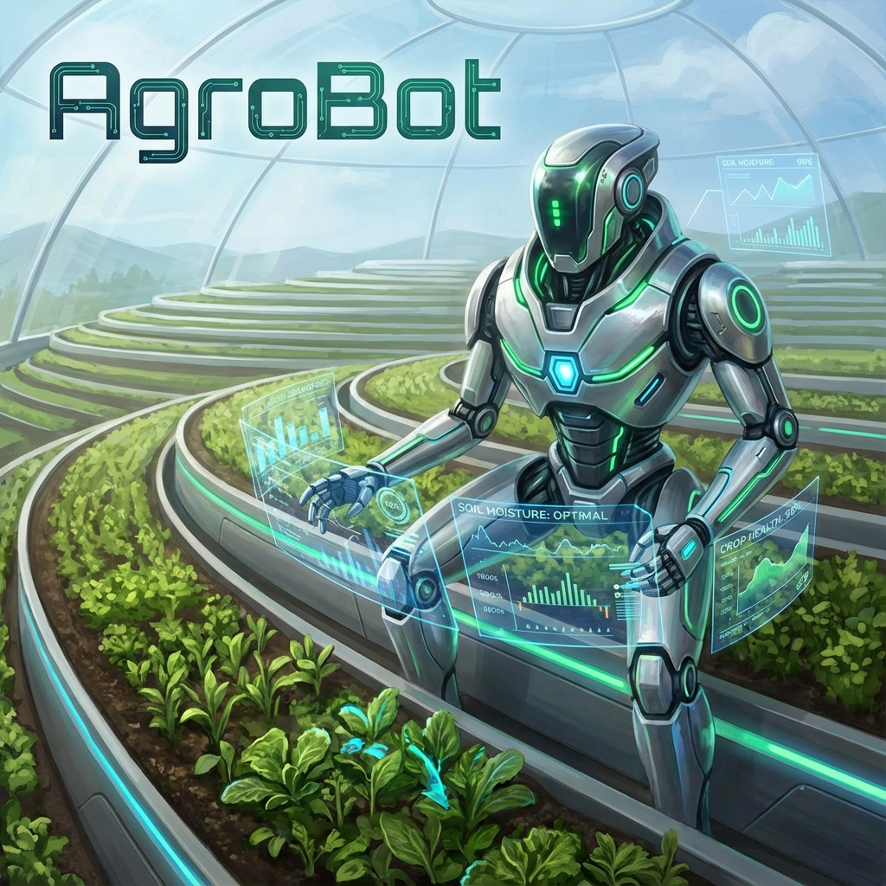

# AgroBot 🚜🤖



[](https://opensource.org/licenses/MIT)
[](https://github.com/bahattinyunus/AgroBot)
[](http://makeapullrequest.com)

**AgroBot** is an advanced autonomous agricultural robot designed to optimize farming operations through smart monitoring, precise intervention, and data-driven decision making.

## 🚀 Features

*   **Autonomous Navigation**: Self-driving capabilities in complex field environments.
*   **Crop Monitoring**: Real-time health assessment using computer vision.
*   **Precision Agriculture**: Targeted spraying and resource application.
*   **Data Analytics**: Comprehensive dashboard for farm management.

## � Legacy Documentation: Auto Navi Expo

*(Restored from previous version)*

### auto_navi_expo
    
*   ...
*   way_points.          
*   9. You will need to [Check configuration]

## �🛠️ Installation

1.  Clone the repository:
    ```bash
    git clone https://github.com/bahattinyunus/AgroBot.git
    cd AgroBot
    ```

2.  Install dependencies (Example):
    ```bash
    pip install -r requirements.txt
    ```

## 📖 Usage

Run the main control loop:

```bash
python src/main.py
```

## 🤝 Contributing

Contributions are what make the open source community such an amazing place to learn, inspire, and create. Any contributions you make are **greatly appreciated**.

Please refer to the [CONTRIBUTING.md](CONTRIBUTING.md) file for more details.

## 📜 License

Distributed under the MIT License. See `LICENSE` for more information.

## 📞 Contact

Bahattin Yunus - [GitHub Profile](https://github.com/bahattinyunus)
